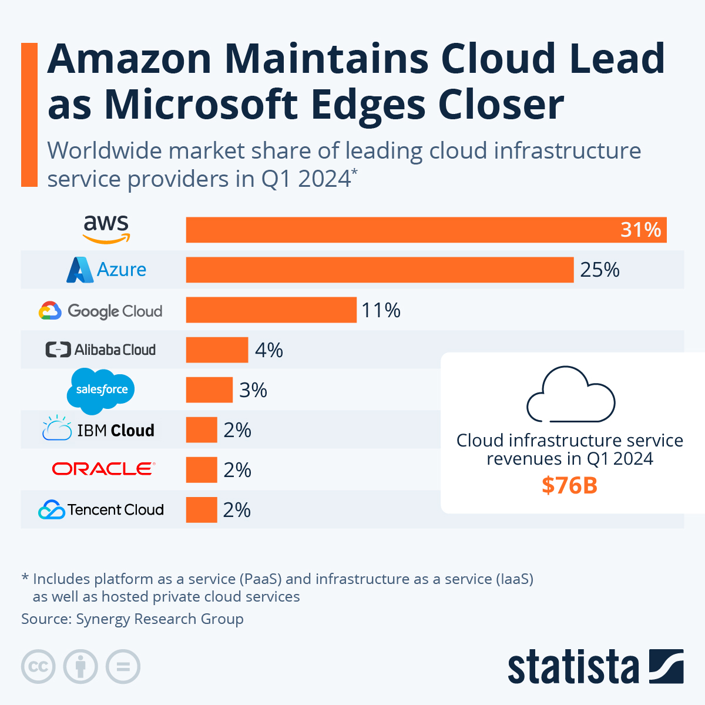

# Cloud

### What is Cloud Computing?
Cloud computing is a technology that allows individuals and businesses to access and use computing resources (such as servers, storage, databases, networking, software, and analytics) over the internet, often referred to as "the cloud." 
Instead of buying, owning and maintaining physical hardware and software, users can rent or lease these resources from cloud service providers like AWS on a pay-as-you-go basis.

### How do we know if something is in the cloud?
In order to know if something is in the cloud, we need to understand the characteristics and functionalities of cloud computing.
The following are key indicators that an application or data is cloud-based:
- Access via the Internet
  - Access a service through a web browser without installing any software (example: Netflix)
  - Services that offer RESTful APIs or other web-based API interfaces.

- Subscription
  -  If you are billed monthly or based on how much you use the service.
  
- Scalability and Elasticity
  - Services, which are in the cloud, can scale resources up or down.
  - Service adjusts its performance or capacity automatically.

- Multi-Tenancy
  - If you share the same physical resources with other users but have isolated data.

- Remote Storage
  - If your data is stored on servers located in remote data centers rather than on your local device/company’s on-premises servers. (example: Google Drive)

- Regular Updates and Maintenance by Provider
  - If you don’t need to worry about applying patches, updates, or maintaining the hardware.

- Accessibility Across Multiple Devices
  - You can access your service or data from multiple devices (example: Microsoft Office 365)

### Differences between on-prem and the cloud?
The main differences are, how they are deployed, managed, accessed, and billed.

Deployment:
- On-Prem: All hardware and software are installed and run on the company’s premises.
- The cloud: Resources are hosted by third-party service providers in remote data centers.

Management:
- On-Prem: Managed by the company’s IT department.
- The cloud: Managed by the cloud service provider.

Accessibility:
- On-Prem: Generally restricted to within the company’s network, unless remote access solutions (like VPN) are implemented.
- The cloud: Accessible from anywhere with an internet connection.

Cost:
- On-Prem: High initial investment in hardware, software licenses, and infrastructure and ongoing costs for maintenance and staff.
- The cloud: Typically low or no initial capital expenditure. You only pay for what you have used.

### The 4 deployment models of cloud: private vs public vs hybrid vs multi-cloud - Differences?
Private Cloud:
  - is a computing environment dedicated exclusively to one organization.
  - can provide services on-premises or by a third-party provider but is always private and isolated from others.
    - Pro: maximum control, security, and customization.
    - Con: higher costs and limited scalability.
    
Public Cloud:
  - is a shared computing environment where multiple organizations use the same infrastructure. 
  - Services are provided by third-party cloud service providers.
    - Pro: cost-efficiency, scalability, and minimal management.
    - Con: less control and potential security concerns.
    
Hybrid Cloud:
  - combines private and public clouds, allowing data and applications to be shared between them.
    - Pro: flexibility, cost-efficiency, and scalability.
    - Con: increased complexity.
    
Multi-Cloud:
  - involves using multiple cloud services from different providers to avoid dependency on a single provider and to leverage the best capabilities of each.
    - Pro: multiple providers for optimization and resilience.
    - Con: higher complexity and management overhead.

### Types of cloud services: IaaS, PaaS, SaaS - What are differences?
IaaS (Infrastructure as a Service)
- provides end users with infrastructures, allowing businesses to purchase resources on-demand.
- cloud provider manages the physical infrastructure, while the user manages the operating system.

PaaS (Platform as a Service)
- provides developers with a framework, software and tools needed to build software — all accessible through the internet. 
- provides broader access to servers, storage and networking.

SaaS (Software as a Service)
- most commonly used service within the cloud.
- make software available to users over the internet, usually for a monthly subscription fee.

### What are the advantages/disadvantages of the cloud? (Particularly for a business)
Advantages:
- Cost Efficiency 
  - Reduced Capital Expenditure, Pay-As-You-Go
- Scalability and Flexibility
  - easily scalable on demand, adaptable to changes
- Accessibility
  - can be accessed from anywhere, as long there is an internet connection
- Backup
  - Automatic backups reduces the risk of data loss

Disadvantages:
- Dependent on Internet
  - Reliable internet access is crucial to access the cloud
- Compliance Issues
  - Ensuring compliance with data protection regulations across different regions
- Performance Issues
  - can be affected if multiple companies are using same cloud infrastructure.
- Cost Management
  - might pay for unused resources if they overestimate their needs.

### Difference between OpEx vs CapEx and how it relates the cloud
CapEx (Capital Expenditure)
- refers to the funds used by a company to acquire, upgrade, and maintain physical assets(e.g. buildings or equipment).

OpEx (Operational Expenditure)
- refers to the funds used by a company for its day-to-day expenses. (e.g. run the business = rent, utilities, salaries, services).

How CapEx and OpEx Relate to the Cloud
- Investing in on-premises infrastructure involves significant CapEx (e.g. purchasing servers, networking equipment, storage devices).
- Using cloud services like IaaS, PaaS, or SaaS typically falls under OpEx.

### Is migrating to the cloud always cheaper?
Here are a few key considerations that can influence whether migrating to the cloud is cheaper or not:
- Usage Patterns
  - If the workload is highly variable, then the company can benefit from the cloud's scalability and pay-as-you-go.
  - If the workload is stable and predictable, it might be more cost-effective to invest in on-premises infrastructure.

- Initial Costs
  - The cloud can reduce the need for upfront CapEx.
  - There can be initial costs associated with migration, including re-architecting applications, training staff.

### Marketshare - What is the breakdown? Add a diagram to help understand marketshare trends
Market share is the percent of total sales in an industry generated by a particular company.
It is calculated by dividing the company's sales over the period by the industry's total sales over the same period. 
This provides us with a general idea of the size of a company in relation to its market and competitors. 

### What are the 3 largest Cloud providers known for (What makes them popular? Any USPs?)
Amazon Web Services (AWS):
- known for its global infrastructure
- offers an extensive range of cloud services across compute, storage, databases, machine learning, analytics
- introduces new services and features continually

Microsoft Azure:
- seamlessly integrates with Microsoft's suite of products and services
- provides strong support for hybrid cloud deployments
- is popular due to its robust security features

Google Cloud Platform (GCP):
- is known for its strong capabilities in data analytics and AI
- provides reliable and scalable network services
- is a popular choice for containerized workloads as it allows organizations to easily deploy, manage, and scale containerized applications

### Which cloud provider do you think might be the best? Why?
A cloud provider being the best depends on the specific business needs, technical requirements, budget considerations, and strategic goals.
Each cloud provider has its unique strengths and capabilities.
In order to create the best cloud depending on the organization's needs, you might want you consider a Multi-Cloud to combine the unique strengths of different cloud providers.

### What sort of things do you usually need to pay for when using the cloud?
- Computing resources
- Data storage
- Data transfer
- Databases
- Compliance and Security

### How is data used/managed in the cloud? What do data professionals need to know to leverage cloud technologies effectively?
Storage:
- Data professionals need to understand the characteristics and use cases of each storage service and how to manage, and optimize storage resources

Analytics:
- Data professionals need to understand, how to use managed services (such as Apache Hadoop/Apache Spark etc.) to process and analyze large datasets 

Database:
- Data professionals should understand, how to choose the right database for their use case, provision and configure databases, optimize performance, and ensure data durability and availability.

Data Security:
- Data professionals need to understand cloud security: encryption techniques, access controls, authentication mechanisms, auditing etc.

### Case studies 
The following case studies are showing how businesses have migrated to the cloud or used the cloud to improve in some way.

Netflix:
- migrated its entire infrastructure to the cloud.
- gained scalability and flexibility to handle its massive volume of streaming data and global audience by using AWS.
- this allowed Netflix to rapidly deploy new features, optimize content delivery, and improve the viewer experience.

Airbnb:
- migrated its infrastructure to the cloud to support its rapid growth and global expansion.
- gained the scalability and agility needed to handle peak demand and experiment with machine learning algorithms for personalized recommendations and fraud detection by using AWS.

Capital One:
- accelerated application development, and leveraged advanced analytics and machine learning capabilities to enhance fraud detection, risk management, and customer insights by migrating to AWS.

